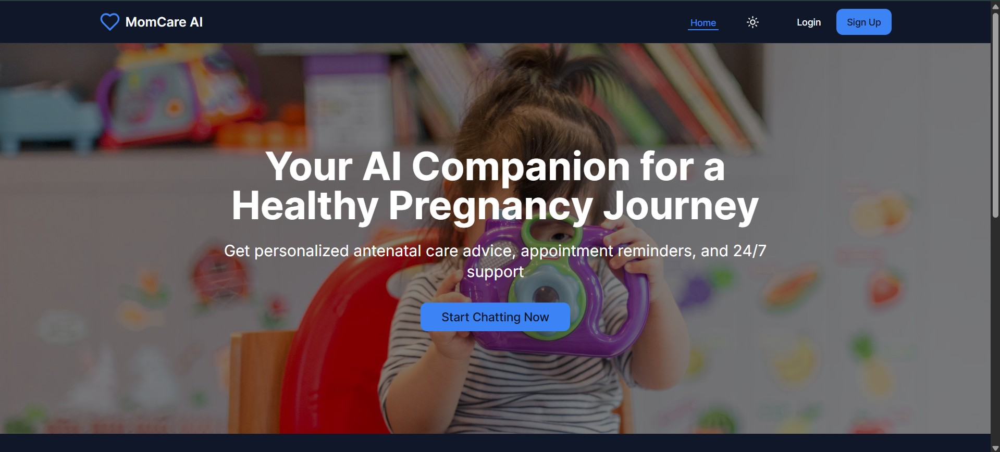

# MOMCARE – Your AI Companion for a Healthy Pregnancy 🤰🤖

MOMCARE is an AI-driven chatbot designed to support pregnant women with **personalized health guidance, emotional well-being tips, and nutritional advice**. Leveraging advanced AI, MOMCARE ensures that expectant mothers receive **accurate and timely information** for a safe and comfortable pregnancy journey.



## 📌 About
MOMCARE is more than just an assistant—it's a **trusted companion** for every stage of pregnancy. Whether you're looking for expert health tips, mindfulness exercises, or help with appointment reminders, our AI-powered platform is here to **support you every step of the way**.

## 🔥 Features

### 💡 Core Features
- **AI-Powered Chatbot** – 24/7 personalized pregnancy advice using Google Gemini AI
- **Comprehensive Dashboard** – Track pregnancy progress, health metrics, and appointments
- **Health Monitoring** – Record and visualize weight, blood pressure, blood sugar, and heart rate
- **Appointment Management** – Schedule, edit, and track prenatal appointments
- **Medical Document Storage** – Upload, view, and manage medical records with OCR text extraction
- **Emergency Support** – Quick access to emergency services and hospital mapping

### 🧘‍♀️ Wellness & Support
- **Emotional Support & Mindfulness** – AI-driven mental well-being assistance
- **Personalized Tips** – Trimester-specific advice and recommendations
- **Educational Resources** – Comprehensive library of pregnancy-related articles
- **Progress Tracking** – Visual pregnancy timeline and milestone tracking

### 🗺 Smart Location Services
- **Nearby Hospital Mapping** – Find the nearest medical centers instantly using Google Maps
- **Emergency Contact Management** – Store and manage emergency contacts
- **Location-Based Advice** – Personalized recommendations based on your location

### 📱 Technical Features
- **Medical Document OCR** – Extract text from images and PDFs using Tesseract.js
- **Real-time Charts** – Health data visualization with Recharts
- **Responsive Design** – Modern UI with Tailwind CSS and shadcn/ui components
- **Multi-Language Support** – Ready for internationalization
- **Secure Authentication** – Powered by Appwrite backend services

## 🛠️ Tech Stack

### Frontend
- **Framework**: Next.js 15 with React 18
- **Styling**: Tailwind CSS with shadcn/ui components
- **Animations**: Framer Motion
- **Charts**: Recharts for health data visualization
- **Maps**: Google Maps API integration
- **Notifications**: React Toastify

### Backend & Services
- **Backend-as-a-Service**: Appwrite
- **AI Integration**: Google Gemini API
- **OCR**: Tesseract.js for document text extraction
- **PDF Processing**: react-pdftotext
- **Image Processing**: Next.js Image optimization

### Key Libraries
- **UI Components**: Radix UI primitives with custom styling
- **Form Handling**: React Hook Form with Zod validation
- **Authentication**: Appwrite Auth
- **File Storage**: Appwrite Storage
- **Database**: Appwrite Database (NoSQL)

## 🚀 Getting Started

### Prerequisites
- Node.js 18+ 
- npm or yarn
- Appwrite account
- Google Cloud account (for Maps and Gemini AI APIs)

### Installation

1. **Clone the repository**
   ```bash
   git clone https://github.com/yourusername/MOMCARE.git
   cd MOMCARE
   ```

2. **Install dependencies**
   ```bash
   npm install
   # or
   yarn install
   ```

3. **Set up environment variables**
   ```bash
   cp .env.example .env.local
   ```
   
   Fill in your API keys and configuration:
   ```env
   # Appwrite Configuration
   NEXT_PUBLIC_APPWRITE_ENDPOINT=https://cloud.appwrite.io/v1
   NEXT_PUBLIC_APPWRITE_PROJECT_ID=your_project_id
   NEXT_PUBLIC_APPWRITE_DATABASE_ID=your_database_id
   NEXT_PUBLIC_APPWRITE_USERS_COLLECTION_ID=your_users_collection_id
   NEXT_PUBLIC_APPWRITE_MEDICAL_DOCS_COLLECTION_ID=your_medical_docs_collection_id
   NEXT_PUBLIC_APPWRITE_APPOINTMENTS_COLLECTION_ID=your_appointments_collection_id
   NEXT_PUBLIC_APPWRITE_HEALTH_RECORDS_COLLECTION_ID=your_health_records_collection_id
   NEXT_PUBLIC_APPWRITE_PROFILE_BUCKET_ID=your_profile_bucket_id
   NEXT_PUBLIC_APPWRITE_MEDICAL_DOCS_BUCKET_ID=your_medical_docs_bucket_id
   
   # Google APIs
   NEXT_PUBLIC_GOOGLE_MAPS_API_KEY=your_google_maps_api_key
   NEXT_PUBLIC_GEMINI_API_KEY=your_gemini_api_key
   ```

4. **Set up Appwrite Backend**
   
   Create the following collections in your Appwrite database:
   
   **Users Collection** (users):
   - name (string)
   - email (string)
   - phone (string)
   - dob (string)
   - address (string)
   - weeksPregnant (integer)
   - dueDate (string)
   
   **Medical Documents Collection** (medical_docs):
   - userId (string, relationship to users)
   - fileId (string)
   - title (string)
   - description (string)
   - mimeType (string)
   - size (integer)
   - url (string)
   - createdAt (datetime)
   
   **Appointments Collection** (appointments):
   - userId (string, relationship to users)
   - date (string)
   - time (string)
   - type (string)
   - doctor (string)
   - doctorPhone (string)
   - notes (string)
   - status (string)
   - createdAt (datetime)
   
   **Health Records Collection** (health_records):
   - userId (string, relationship to users)
   - type (string)
   - value (float)
   - unit (string)
   - notes (string)
   - recordedAt (datetime)

5. **Configure Storage Buckets**
   
   Create two storage buckets in Appwrite:
   - **Profile Photos** (profile_photos)
   - **Medical Documents** (medical_documents)
   
   Set appropriate permissions for authenticated users.

6. **Start the development server**
   ```bash
   npm run dev
   # or
   yarn dev
   ```

7. **Open your browser**
   Navigate to [http://localhost:3000](http://localhost:3000)

## 📊 Dashboard Highlights

Your dashboard serves as your pregnancy command center with:

- **Current Week of Pregnancy** – Stay aware of your pregnancy progress
- **Doctor Appointment Tracker** – View and manage doctor visits
- **Health Charts** – Monitor blood pressure, weight, and blood sugar over time
- **Medicine Reminders** – Never miss a dose with built-in alerts
- **Quick Actions** – Fast access to chat, appointments, and emergency services
- **Educational Tips** – Personalized advice for your current week

## 🔧 Configuration

### Google Maps Setup
1. Enable Google Maps JavaScript API and Places API
2. Configure API key restrictions for security
3. Add your domain to the API key restrictions

### Google Gemini AI Setup
1. Create a project in Google AI Studio
2. Generate an API key for Gemini
3. Configure the API key in your environment variables

### Appwrite Setup
1. Create a new project in Appwrite
2. Set up authentication methods
3. Configure database collections and storage buckets
4. Set up appropriate permissions for each resource

## 🎯 Roadmap

### Upcoming Features
- 🔍 **Advanced AI Diagnostics** – More accurate health predictions
- 🍽 **Personalized Nutrition Plans** – AI-driven meal recommendations
- 🌎 **Global Language Expansion** – More multilingual support
- ⌚ **Wearable Device Integration** – Enhanced tracking and analytics
- 📱 **Mobile App** – Native iOS and Android applications
- 🔔 **Push Notifications** – Appointment and medication reminders
- 👥 **Community Features** – Connect with other expecting mothers
- 📈 **Advanced Analytics** – Detailed health insights and trends

### Technical Improvements
- **Offline Support** – PWA capabilities for offline access
- **Voice Assistant** – Voice-activated AI interactions
- **Telemedicine Integration** – Video consultations with doctors
- **Health Device Sync** – Integration with fitness trackers and smart scales
- **Advanced Security** – Enhanced data encryption and privacy features

## 🤝 Contributing

We welcome contributions! Here's how you can help:

1. **Fork the repository**
2. **Create a feature branch** (`git checkout -b feature/amazing-feature`)
3. **Commit your changes** (`git commit -m 'Add amazing feature'`)
4. **Push to the branch** (`git push origin feature/amazing-feature`)
5. **Open a Pull Request**

### Development Guidelines
- Follow the existing code style and conventions
- Write clear commit messages
- Add tests for new features
- Update documentation as needed
- Ensure responsive design compatibility

## 📄 License

This project is licensed under the MIT License - see the [LICENSE](LICENSE) file for details.

## 👥 Contributors

- **Sahil Adhikari** - Lead Developer
- **Aditya Verma** - Backend Developer  
- **Aditi Roy** - UI/UX Designer

## 🆘 Support

### Getting Help
- **Documentation**: Check this README and code comments
- **Issues**: Create an issue on GitHub for bugs or feature requests
- **Discussions**: Use GitHub Discussions for questions and ideas

### Emergency Features
- **Emergency Numbers**: Quick access to local emergency services
- **Hospital Locator**: Find nearby hospitals with maternity services
- **Warning Signs**: Comprehensive guide to pregnancy warning signs
- **First Aid Tips**: Emergency first aid information for pregnancy

## 🙏 Acknowledgments

- Google Gemini AI for powering our intelligent chatbot
- Appwrite for providing robust backend services
- The open-source community for amazing libraries and tools
- Healthcare professionals who provided medical guidance
- Beta testers and early users for valuable feedback

---

**Stay healthy, stay informed, and enjoy your pregnancy journey with MOMCARE!** 💖👩‍⚕️🤰

For more information, visit our [website](https://momcare.app) or contact us at support@momcare.app
